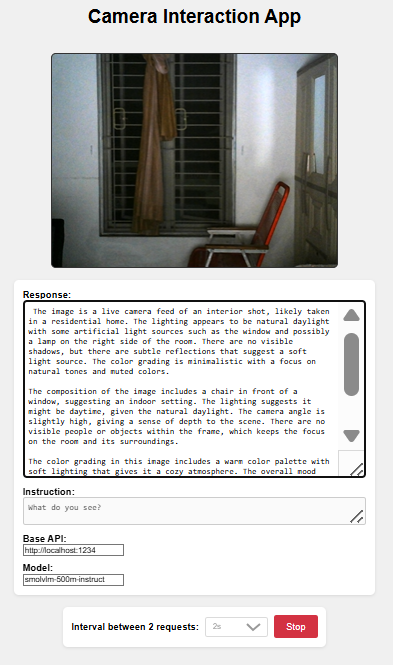

# SmolVLM real-time camera demo

This repository is a simple demo for how to use LM Studio server with SmolVLM 500M to get real-time object detection. This a fork from [ngxson/smolvlm-realtime-webcam](ngxson/smolvlm-realtime-webcam) which focus on ollama.

## How to setup

1. Download and Install [LM Studio](https://lmstudio.ai/)
2. Inside LM Studio, download `https://model.lmstudio.ai/download/ggml-org/SmolVLM-500M-Instruct-GGUF`     
3. Open `index.html`
4. Optionally change the instruction (for example, make it returns JSON)
5. Click on "Start" and enjoy
